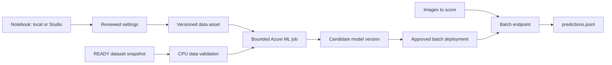

# Azure Machine Learning YOLO MLOps starter

Start an Ultralytics YOLO object-detection project locally or in Azure ML
Studio, move the proven experiment to a cost-controlled Azure Machine Learning
job, and then operate it as a continuous-training pipeline. Training and
deployment remain separate so a successful training run never replaces the
production model automatically.

The sample follows three deliberate stages:

1. **Learn and experiment:** run the Jupyter notebook locally or in Azure ML
  Studio with COCO8, then point it at a customer YOLO dataset.
2. **Make training repeatable:** transfer the notebook settings to a bounded,
  versioned Azure ML command job that can scale compute down to zero.
3. **Operate continuously:** publish immutable dataset snapshots, validate them
  on CPU, train candidates, and promote only approved model versions.

The default design favors low operating cost:

- CPU is used for the eight-image smoke test and batch inference.
- GPU compute is used only for production training.
- Both clusters scale from zero and the default maximum is one node.
- Data and model versions are explicit to prevent accidental, irreproducible runs.

## Architecture



## Repository layout

```text
.
|-- .github/workflows/ # Validation, setup, training, simulation, and deployment
|-- azureml/
|   |-- compute/       # Scale-to-zero CPU and GPU clusters
|   |-- datastores/    # Identity-based continuous-training storage
|   |-- endpoints/     # Batch endpoint and deployment
|   `-- jobs/          # Smoke and production training jobs
|-- infra/             # Azure RBAC and Blob container Bicep
|-- scripts/           # Reusable Azure ML workflow operations
|-- src/               # Training and scoring entry points
|-- tests/             # Fast tests that do not require Azure or model downloads
|-- pyproject.toml      # Local and Studio Python dependencies
`-- yolo-training-test.ipynb # Beginner-first interactive experiment
```

The checked-in names are runnable defaults, not required project names. Keep
reviewed profile defaults in Azure ML YAML and pass environment-specific values
through CLI overrides or GitHub repository/environment variables. This lets a
team reuse the starter without search-and-replace edits across scripts.

## Training options

| Area | Notebook | Smoke job | Production job |
| --- | --- | --- | --- |
| Definition | [`yolo-training-test.ipynb`](yolo-training-test.ipynb) | [`azureml/jobs/coco8-smoke.yml`](azureml/jobs/coco8-smoke.yml) | [`azureml/jobs/train.yml`](azureml/jobs/train.yml) |
| Purpose | Interactive learning and inspection | Low-cost Azure integration check | Reproducible customer-data training |
| Training entry point | Calls `YOLO.train()` directly | Runs `src/train.py` | Runs `src/train.py` |
| Dataset | COCO8 by default; preset or project-relative custom YAML | Public COCO8 | Versioned `yolo-training-data` asset |
| Base model | `yolo11n.pt` | `yolo11n.pt` | `yolo11n.pt` |
| Epochs | 1 | 1 | 50 |
| Image size | 320 | 320 | 640 |
| Batch size | 4 | 4 | 16 |
| Device | CPU by default; optional GPU | CPU cluster | GPU cluster |
| Runs on | Local machine or Azure ML Studio compute instance | Azure ML managed CPU job | Azure ML managed GPU job |
| Compute lifecycle | Local process; Studio instance must be stopped manually | Cluster scales to zero after the job | Cluster scales to zero after the job |
| Environment | Selected notebook kernel | Pinned Ultralytics container | Pinned Ultralytics container |
| Validation | Configurable | Enabled by Ultralytics defaults | Enabled by Ultralytics defaults |
| Training plots | Enabled | Disabled | Disabled |
| Output | Project-relative `notebook-output/model.pt`; persisted in Studio Files when run there | Managed Azure ML `model.pt` | Managed Azure ML `model.pt` |
| Extra behavior | Metrics, sample prediction, and visualization | Training smoke test only | Training and managed artifact upload |
| Typical cost | Free locally; Studio compute is billed until stopped | Low; CPU billed while active | Higher; GPU billed while active |

The notebook closely mirrors the smoke profile but adds interactive plots and
prediction. Once a dataset and settings work there, copy `MODEL`, `EPOCHS`,
`IMAGE_SIZE`, `BATCH_SIZE`, and `DEVICE` into the corresponding Azure ML job
inputs. Use the smoke job to verify the managed path before allocating a GPU.
For Studio notebooks, closing the browser does not stop billing; stop the
instance under **Compute > Compute instances**.

## Key concepts

- **Workspace** stores Azure ML jobs, data, models, endpoints, and run history.
- **Data asset** is a named, versioned reference to files in storage.
- **Compute cluster** creates nodes on demand and can scale back to zero.
- **Model asset** is a versioned artifact produced by a training job.
- **Batch endpoint** asynchronously scores a folder of files.
- **Deployment** binds a model, scoring code, environment, and compute.

## Recommended developer journey

Use this order when exploring the project:

1. Run `yolo-training-test.ipynb` locally for no Azure compute cost, or on a
  billable Azure ML Studio compute instance, with its one-epoch COCO8 default.
2. Point `CUSTOM_DATA_YAML` at a small, representative customer dataset and
  validate labels, metrics, predictions, memory use, and runtime.
3. Run the Azure ML COCO8 smoke job on the scale-to-zero CPU cluster.
4. Submit the versioned customer dataset with the same reviewed settings as a
  managed job. Start small, then increase epochs, image size, or model size.
5. Configure continuous training only after manual training is reproducible.
6. Deploy batch inference only after reviewing a candidate model version.

Avoid using an Azure ML compute instance for routine jobs. Unlike these
clusters, a compute instance remains billable until it is explicitly stopped.

## 1. Prerequisites

For local use, install:

- Python 3.10, 3.11, or 3.12
- Azure CLI
- PowerShell 7 for the examples below
- An Azure ML workspace and permission to create jobs and assets

For Azure ML Studio, create or select a compute instance with Python 3.10-3.12,
then clone or upload the full repository under **Notebooks > Files**. The full
repository is required because the notebook imports code from `src/`.

| Area | Local machine | Azure ML Studio |
| --- | --- | --- |
| Repository | Clone to a local folder | Clone or upload under **Notebooks > Files** |
| Python | Repository `.venv` | Compute-instance kernel or repository `.venv` |
| Custom data | Local relative path | Upload beside the project or mount/download data to a filesystem path |
| Outputs | Local project folder | Studio Files project folder; persists after compute stops |
| Terminal | PowerShell examples below | Linux terminal; use `\` instead of PowerShell backticks |
| Cost | No Azure notebook compute charge | Billed while the compute instance is running |

Azure CLI examples can run locally, in Cloud Shell, or in a Studio terminal.
In Studio, use `export NAME=value`, Linux paths, and `\` for line continuation.

Set the Azure context for the current shell. Replace all example values:

```powershell
$env:AZURE_SUBSCRIPTION_ID = "<subscription-id>"
$env:AZURE_RESOURCE_GROUP = "<resource-group>"
$env:AZURE_ML_WORKSPACE = "<workspace-name>"
$env:AZURE_LOCATION = "<region>"

az login
az account set --subscription $env:AZURE_SUBSCRIPTION_ID
az extension add --name ml --upgrade --yes
az configure --defaults `
  group=$env:AZURE_RESOURCE_GROUP `
  workspace=$env:AZURE_ML_WORKSPACE `
  location=$env:AZURE_LOCATION
az ml workspace show --query "{name:name,location:location}" --output table
```

The submitting identity needs permission to run Azure ML jobs and manage the
assets used here. It may also need **Storage Blob Data Contributor** on the
workspace storage account. Use the narrowest Azure roles allowed by your
organization instead of broad subscription-level roles.

## 2. Start in the notebook

For local use, create an isolated environment and install dependencies:

```powershell
uv venv --python 3.12 .venv
.\.venv\Scripts\Activate.ps1
python -m ensurepip --upgrade
python -m pip install -e ".[dev,notebook]"
```

The repository pins Python 3.12 in `.python-version`. If Python 3.12 is already
installed, `python -m venv .venv` is also sufficient after confirming
`python --version` reports 3.12.

In Azure ML Studio, open a terminal in the uploaded repository and run:

```bash
python -m pip install -e ".[dev,notebook]"
```

Open `yolo-training-test.ipynb`, select the prepared kernel, and run the cells
from top to bottom. Keep the default COCO8, one epoch, 320-pixel image size,
batch size 4, and CPU device for the first run. Then set `CUSTOM_DATA_YAML` to
your `data.yaml`. In Studio, use a path under the uploaded project folder. The
notebook runs the same dataset contract checks as the managed CPU job.

The installation cell is a fallback for hosted notebooks. A prepared local or
Studio environment already has the declared packages and skips installation.

Run the fast checks before submitting a paid cloud job. The **Validate Starter**
workflow runs these checks automatically for pushes and pull requests:

```powershell
python -m pytest -q
python -m compileall -q src tests
ruff check src tests
python -c "import pathlib,yaml; [yaml.safe_load(p.read_text()) for p in pathlib.Path('.').rglob('*.yml')]; print('YAML OK')"
```

The same checks run in a Studio terminal, but the compute instance remains
billable while they execute. Prefer local development or GitHub Actions for
routine validation.

## 3. Convert the experiment to Azure ML

Review VM availability, quota, and current regional pricing before creation.
The checked-in defaults are:

| Purpose | VM size | Nodes | Idle scale-down |
| --- | --- | --- | --- |
| CPU smoke and batch | `Standard_D2a_v4` | 0-1 | 120 seconds |
| GPU training | `Standard_NC4as_T4_v3` | 0-1 | 120 seconds |

Create only the CPU cluster first. The names below are defaults and can be
changed in the YAML or overridden by the documented GitHub variables:

```powershell
az ml compute create --file azureml/compute/batch-cpu.yml
```

Create the GPU cluster when production training is ready:

```powershell
az ml compute create --file azureml/compute/yolo-gpu.yml
```

If the workspace requires a virtual network, add `network_settings.subnet` to
each compute definition using that environment's full subnet resource ID. Do
not commit organization-specific subscription or network IDs to this starter.

Azure subscription VM quota and Azure ML managed-compute quota are separate.
If cluster creation reports a quota error, request quota for the exact VM family
in the workspace region. Keeping a cluster at zero nodes avoids VM charges, but
storage, registry, networking, and retained artifacts may still have costs.

### Run the CPU smoke test

COCO8 contains eight public images. This job verifies source upload, container
startup, training, and artifact upload without allocating a GPU:

```powershell
$job = az ml job create `
  --file azureml/jobs/coco8-smoke.yml `
  --query name `
  --output tsv

az ml job stream --name $job
```

After configuring the GitHub variables in section 7, run the same managed test
through GitHub Actions:

```powershell
gh workflow run smoke-test.yml --ref main
gh run watch --workflow smoke-test.yml --exit-status
```

The workflow uses the `training` environment and OIDC identity, submits the job
to `YOLO_CPU_COMPUTE_NAME`, and links the completed Azure ML job in its summary.

Register the resulting file only if you need to test deployment:

```powershell
az ml model create `
  --name yolo-detector `
  --type custom_model `
  --path "azureml://jobs/$job/outputs/model_output/paths/model.pt" `
  --set tags.source_job=$job tags.purpose=smoke-test
```

The smoke job has a one-hour Azure-side timeout. If you use an Azure ML compute
instance for notebook exploration, stop that instance immediately afterward.

## 4. Prepare training data

YOLO expects separate training and validation sets:

```text
dataset/
|-- data.yaml
|-- images/
|   |-- train/image-001.jpg
|   `-- val/image-101.jpg
`-- labels/
    |-- train/image-001.txt
    `-- val/image-101.txt
```

Each image needs a label file with the same base name. One object is represented
by `class_id x_center y_center width height`; coordinates range from 0 to 1.

Example `data.yaml`:

```yaml
path: .
train: images/train
val: images/val
names:
  0: product
  1: damaged-product
```

Before upload, verify matching image/label files, valid class IDs and bounding
boxes, and no overlap between training and validation images.

Run the shared contract validator before registration:

```powershell
python src/validate_dataset.py --data .\dataset\data.yaml
```

In a Studio Linux terminal, use `./dataset/data.yaml`. Files uploaded through
**Notebooks > Files** are available to both the notebook and its terminal.

Upload the dataset through your approved network path, then register an
immutable version. This command can register a folder from the local machine or
from the current Studio project directory:

```powershell
az ml data create `
  --name yolo-training-data `
  --version 1 `
  --type uri_folder `
  --path .\dataset
```

In a Studio terminal, use `--path ./dataset`.

Never overwrite the storage contents behind an existing data version.

## 5. Train and register

The manifest intentionally pins data version `1` as a safe placeholder. Override
it explicitly for each run:

```powershell
$dataVersion = 1
$baseModel = "yolo11n.pt"
$epochs = 5
$job = az ml job create `
  --file azureml/jobs/train.yml `
  --set inputs.training_data.path="azureml:yolo-training-data:$dataVersion" `
        inputs.base_model=$baseModel `
        inputs.epochs=$epochs `
  --query name `
  --output tsv

az ml job stream --name $job
```

Review validation metrics and failed samples before registering the artifact:

```powershell
az ml model create `
  --name yolo-detector `
  --type custom_model `
  --path "azureml://jobs/$job/outputs/model_output/paths/model.pt" `
  --set tags.source_job=$job tags.training_data="yolo-training-data:$dataVersion"
```

The production job timeout is six hours (`21600` seconds), configured with
[`limits.timeout`](https://learn.microsoft.com/azure/machine-learning/reference-yaml-job-command#yaml-syntax)
at the end of [`azureml/jobs/train.yml`](azureml/jobs/train.yml):

```yaml
limits:
  timeout: 21600
```

Azure ML cancels the command job when this limit is reached. Override
`inputs.image_size`, `inputs.batch_size`, `inputs.device`, or `compute` the same
way when moving reviewed notebook settings into Azure ML. Commit profile changes
only when they should become defaults for every developer and workflow run.

## 6. Deploy and invoke batch inference

Create the endpoint once:

```powershell
az ml batch-endpoint show --name yolo-batch *> $null
if ($LASTEXITCODE -ne 0) {
  az ml batch-endpoint create --file azureml/endpoints/batch-endpoint.yml
}
```

Deploy an approved model version. Use one deployment name per model version so
rollback means selecting an earlier deployment:

```powershell
$modelVersion = 1
az ml batch-deployment create `
  --file azureml/endpoints/batch-deployment.yml `
  --set name="model-v$modelVersion" model="azureml:yolo-detector:$modelVersion" `
  --set-default
```

Register a folder of inference images and invoke the endpoint:

```powershell
az ml data create `
  --name yolo-inference-input `
  --version 1 `
  --type uri_folder `
  --path .\inference-images

$inferenceJob = az ml batch-endpoint invoke `
  --name yolo-batch `
  --input azureml:yolo-inference-input:1 `
  --query name `
  --output tsv

az ml job stream --name $inferenceJob
```

The output is `predictions.jsonl`. Each line includes the image name, status,
and detections. A corrupt image generates an error record so other images can
continue, while an unhandled mini-batch failure fails the job because the
deployment uses `error_threshold: 0`. Monitor application-level error records.

## 7. Configure continuous training

The workflows use OpenID Connect, avoiding a long-lived Azure client secret.
Create GitHub environments named `infrastructure`, `training`, and `production`.
Require reviewers for `infrastructure` and `production`. Define these variables
where the workflows that use them can access them:

| Variable | Description |
| --- | --- |
| `AZURE_CLIENT_ID` | Federated Entra application client ID |
| `AZURE_TENANT_ID` | Entra tenant ID |
| `AZURE_SUBSCRIPTION_ID` | Target subscription ID |
| `AZURE_RESOURCE_GROUP` | Azure ML resource group |
| `AZURE_ML_WORKSPACE` | Azure ML workspace name |
| `AZURE_ML_EXTENSION_VERSION` | Tested Azure ML CLI extension version to install |
| `AZURE_CLIENT_OBJECT_ID` | Object ID of the OIDC service principal; infrastructure only |
| `YOLO_STORAGE_ACCOUNT_NAME` | Existing storage account receiving dataset snapshots |
| `YOLO_STORAGE_CONTAINER_NAME` | Optional container; defaults to `yolo-training` |
| `YOLO_STORAGE_PREFIX` | Optional marker prefix; defaults to `continuous-training` |
| `YOLO_AML_DATASTORE_NAME` | Optional datastore; defaults to `yolo_continuous_training` |
| `YOLO_DATA_ASSET_NAME` | Optional data asset; defaults to `yolo-training-data` |
| `YOLO_MODEL_NAME` | Optional model name; defaults to `yolo-detector` |
| `YOLO_TEST_MODEL_NAME` | Optional isolated test model; defaults to `<YOLO_MODEL_NAME>-test` |
| `YOLO_BASE_MODEL` | Optional Ultralytics checkpoint name or accessible path; defaults to `yolo11n.pt` |
| `YOLO_CPU_COMPUTE_NAME` | Optional validation, test, and batch cluster; defaults to `yolo-batch-cpu` |
| `YOLO_GPU_COMPUTE_NAME` | Optional production training cluster; defaults to `yolo-gpu-cluster` |
| `YOLO_BATCH_ENDPOINT_NAME` | Optional endpoint name; defaults to `yolo-batch` |

### GitHub Actions workflow map

The seven workflows are related, but they are not a seven-step sequence:

| Workflow | Role | Trigger | When to run | Depends on |
| --- | --- | --- | --- | --- |
| **Validate Starter** | CI | Push, pull request, or manual | On every code change | Nothing in Azure |
| **Set Up Continuous Training** | Infrastructure bootstrap | Manual | Once, then after infrastructure changes | OIDC identity, repository variables, existing workspace, storage account, and CPU compute |
| **Run Azure ML Smoke Test** | Managed integration test | Manual | Before more expensive training changes | OIDC, CPU compute, and setup-provisioned storage access |
| **Simulate Continuous Dataset Arrivals** | Test-data producer | Manual | Only when demonstrating continuous training | Setup and storage reachable from the runner |
| **Process Continuous Training Batches** | Continuous-training orchestrator | Every six hours or manual | After real or simulated `_READY.json` markers arrive | Setup, reachable storage, and CPU compute; production mode also needs GPU compute |
| **Retrain YOLO** | Direct manual training alternative | Manual | When a reviewed Azure ML data asset already exists | OIDC, the selected data asset, and GPU compute |
| **Deploy YOLO Batch Model** | Production CD | Manual | After reviewing and approving a production model version | OIDC, approved registered model, CPU batch compute, and production approval |

For a low-cost first verification, run **Validate Starter**, run **Set Up
Continuous Training** once, and then run **Run Azure ML Smoke Test**. Stop there
unless you want to test continuous arrivals or production release.

For the continuous-training demonstration, run **Simulate Continuous Dataset
Arrivals**, then manually run **Process Continuous Training Batches** with the
`test` profile. The simulation and processor are not required for the standalone
smoke test.

For production, use either **Retrain YOLO** with an existing data asset or
**Process Continuous Training Batches** with the `production` profile. Review
the resulting production model, then run **Deploy YOLO Batch Model**. The two
training workflows are alternatives, not consecutive requirements.

The **Retrain YOLO** workflow requires an explicit `name:version` data asset.
The **Deploy YOLO Batch Model** workflow requires an approved numeric model
version and safely updates an existing deployment when rerun.

The workflows are intentionally thin. Azure operations live in
`scripts/retrain.sh` and `scripts/deploy-batch.sh`, allowing the same commands to
be reviewed and tested outside GitHub Actions. Production safeguards include:

- OIDC authentication with no stored Azure client secret.
- Readable major-version tags for maintained GitHub Actions.
- A pinned Azure ML CLI extension version supplied by configuration.
- Input validation and Azure-side checks that the selected data or model exists.
- Six-hour training and one-hour deployment timeouts.
- Concurrency controls that serialize production deployments and prevent two
  runs for the same data version from executing simultaneously.
- Explicit verification of training completion, deployment provisioning state,
  and the endpoint's default deployment.
- GitHub job summaries containing the resulting job, model, and deployment IDs.
- Azure-side time limits, so a disconnected GitHub runner does not leave a job
  consuming compute indefinitely.

The **Validate Starter** workflow requires no Azure credentials and checks
Python tests, lint, YAML parsing, shell syntax, and notebook structure on every
push and pull request.

Test an Azure ML CLI extension release in a non-production environment before
changing `AZURE_ML_EXTENSION_VERSION`. Use the same reviewed version in both
GitHub environments to prevent training and deployment behavior from drifting.

To establish the initial version from a local or Studio terminal:

```powershell
az extension add --name ml --upgrade --yes
az extension show --name ml --query version --output tsv
```

### Continuous-training setup

The continuous-training path uses existing Azure ML and storage accounts plus:

- A private Blob container for immutable cumulative dataset snapshots.
- An identity-based Azure ML datastore connected to that container.
- Storage Blob Data Contributor for the GitHub OIDC identity.
- AzureML Data Scientist for that identity on the workspace.
- Storage Blob Data Reader for the workspace managed identity.
- Storage Blob Data Contributor for the CPU compute managed identity.
- A scale-to-zero CPU validation job before GPU training.

Run **Set Up Continuous Training** once from GitHub Actions. It deploys
`infra/continuous-training.bicep` and creates or updates the datastore. The OIDC
identity running this bootstrap must already have permission to create role
assignments, such as Role Based Access Control Administrator, plus permission to
deploy resources in the resource group. Remove that elevated bootstrap access
after setup if your organization uses just-in-time administration.

Private storage must also permit network access from GitHub-hosted runners for
the polling and simulation workflows. If public network access is disabled, use
a self-hosted runner inside the approved virtual network.

### Simulate continuous arrivals

The simulator downloads COCO128 and uses its 126 valid image/label pairs. It
creates four cumulative versions with a fixed validation set:

| Version | Training images | Validation images |
| --- | ---: | ---: |
| 1 | 25 | 26 |
| 2 | 50 | 26 |
| 3 | 75 | 26 |
| 4 | 100 | 26 |

Generate snapshots locally without using Azure compute:

```powershell
python scripts/simulate_arrivals.py
```

The same command works in a Studio terminal, but uses billable compute and
writes snapshots under Studio Files. Prefer local execution or the simulation
workflow unless the data is available only inside the Studio network.

Use `--storage-prefix customer/project-a` to test a custom Blob hierarchy. The
simulation workflow reads the same value from `YOLO_STORAGE_PREFIX`, and writes
that path into each marker so upload and polling remain aligned.

The output is ignored by Git and written below
`data/continuous-simulation/snapshots`. To exercise the cloud flow, run
**Simulate Continuous Dataset Arrivals**. It uploads each snapshot payload and
then uploads `_READY.json` last. Existing blobs are not overwritten, preserving
the immutability of a published version.

Each marker follows this contract:

```json
{
  "schema_version": 1,
  "dataset_version": 1,
  "dataset_path": "continuous-training/version-001",
  "training_image_count": 25,
  "validation_image_count": 26,
  "seed": 42,
  "created_at": "2026-09-14T00:00:00+00:00"
}
```

Real data producers must publish the same marker only after `data.yaml`, images,
and labels are complete. Use a new positive integer `dataset_version` and a new
`version-NNN` folder for every snapshot. `created_at` must be a timezone-aware
ISO 8601 timestamp, and image counts must be positive integers.

### Scheduled processing

**Process Continuous Training Batches** runs at minute 17 every six hours and
can also be started manually. It performs these steps serially:

1. Find `_READY.json` markers under the configured storage prefix.
2. Validate the marker schema and ensure its path matches its Blob folder.
3. Skip versions that already produced a model tagged with that data asset.
4. Register the snapshot as an immutable Azure ML data asset version.
5. Run `azureml/jobs/validate-data.yml` on the scale-to-zero CPU cluster.
6. Submit GPU training only after image, label, class, box, and split checks pass.
7. Register and tag the resulting candidate model.

The default limit is one new dataset version per run to control GPU spend. A
scheduled run uses the production profile: 50 epochs on the GPU cluster and the
`yolo-detector` model name. A manual run defaults to the test profile: 2 epochs
on the CPU cluster and the separate `yolo-detector-test` model name. Test models
cannot be selected accidentally by the production deployment workflow.

To simulate two consecutive dataset arrivals end to end:

1. Run **Set Up Continuous Training** once.
2. Run **Simulate Continuous Dataset Arrivals** with its defaults.
3. Run **Process Continuous Training Batches** manually with `max_batches = 2`
   and `training_profile = test`.
4. Confirm data versions 1 and 2 exist and two `yolo-detector-test` versions were
   registered with `training_data` and `training_profile` tags.
5. Rerun the processor with the same inputs; it should skip both versions.

```powershell
az ml data list `
  --name yolo-training-data `
  --query "[].{version:version,path:path}" `
  --output table

az ml model list `
  --name yolo-detector-test `
  --query "[].{version:version,data:tags.training_data,profile:tags.training_profile}" `
  --output table
```

A manual run can raise `max_batches`, but all processing remains serialized.
GitHub schedule execution may be delayed; use Event Grid and an Azure Function
with the same marker contract if near-real-time triggering becomes a requirement.

### Current automation boundary

The scheduled workflow polls storage; it does not react to each file upload.
Production promotion remains intentionally separate from continuous training.

| Stage | Current owner |
| --- | --- |
| Upload payload and publish `_READY.json` | Data producer or simulation workflow |
| Detect completed snapshots | Scheduled continuous-training workflow |
| Validate marker and dataset structure | Workflow plus Azure ML CPU job |
| Register a new Azure ML data version | Continuous-training workflow |
| Submit and monitor training | Continuous-training or manual retrain workflow |
| Register and tag the resulting model | Retraining script |
| Evaluate model quality thresholds | Manual review |
| Approve production release | GitHub `production` environment reviewers |
| Create or update the batch deployment | **Deploy YOLO Batch Model** workflow |
| Retention cleanup and notifications | Manual |

This design prevents partial uploads and malformed datasets from consuming GPU
quota. Add an automated accuracy-regression gate before considering unattended
production deployment.

## Cost controls

Pricing varies by region and agreement, so estimate with the Azure Pricing
Calculator using your selected VM sizes and expected runtime. Treat the formula
below as the planning baseline:

$$
\text{run cost} \approx
\text{node count} \times \text{billable hours} \times \text{regional VM rate}
+ \text{storage and network charges}
$$

Use these controls from the beginning:

- Keep `min_instances: 0` and `max_instances: 1` until measurements justify scale.
- Start with `yolo11n.pt`, fewer epochs, and lower image size for experiments.
- Use the CPU smoke test before every material environment or path change.
- Submit multiple images per batch; avoid paying startup cost for one image.
- Prefer CPU inference until a timed benchmark proves GPU is cheaper per result.
- Stop Studio compute instances after notebook or terminal work; closing the
  browser does not stop them.
- Pin container images, data versions, and model versions to avoid surprise reruns.
- Set Azure Cost Management budgets and alerts for the resource group.
- Tag resources and model versions with owner, environment, data version, and job.
- Review and delete obsolete endpoint deployments, model/data versions, and job
  outputs according to your organization's retention policy.

Check compute state regularly:

```powershell
az ml compute list `
  --query "[].{name:name,type:type,state:state,min:min_instances,max:max_instances}" `
  --output table
```

Delete an unused endpoint to stop future invocations and simplify cleanup:

```powershell
az ml batch-endpoint delete --name yolo-batch --yes
```

## Reference documentation

- [Manage Azure ML compute instances](https://learn.microsoft.com/azure/machine-learning/how-to-manage-compute-instance) - Studio notebook compute, start/stop, and idle shutdown.
- [Ultralytics YOLO train mode](https://docs.ultralytics.com/modes/train/) - training arguments, devices, validation, and checkpoints.
- [Create Azure ML data assets](https://learn.microsoft.com/azure/machine-learning/how-to-create-data-assets) - immutable versions and `uri_folder` inputs.
- [Train models with Azure ML](https://learn.microsoft.com/azure/machine-learning/how-to-train-model) - command jobs, compute, monitoring, and model registration.
- [Azure ML command-job YAML schema](https://learn.microsoft.com/azure/machine-learning/reference-yaml-job-command) - properties such as the Azure-side `limits.timeout` runtime limit.
- [Deploy Azure ML batch endpoints](https://learn.microsoft.com/azure/machine-learning/how-to-use-batch-endpoint) - deployments, invocation, outputs, and updates.
- [Authenticate GitHub Actions with Azure OIDC](https://learn.microsoft.com/azure/developer/github/connect-from-azure-openid-connect) - federated identity setup without client secrets.
- [Manage and optimize Azure ML cost](https://learn.microsoft.com/azure/machine-learning/how-to-manage-optimize-cost) - budgets, compute sizing, and cleanup guidance.

## Maintenance guide

- Change training behavior in `src/train.py`; expose reusable parameters through
  CLI arguments and Azure ML scalar inputs, then set reviewed production values
  in `azureml/jobs/train.yml`.
- Change response shape in `src/batch_score.py` and add a contract test first.
- Change environment resource names through GitHub variables or CLI `--set`
  overrides; do not duplicate names inside scripts.
- Keep environment-specific IDs out of tracked manifests.
- Add a new immutable data version for every dataset revision.
- Run local checks and COCO8 before a production training run.
- Deploy only reviewed model versions and preserve the previous deployment for
  rollback until the new version is verified.

## Troubleshooting

**`ClusterMinNodesExceedCoreQuota`**: request Azure ML quota in the workspace
region for the exact VM family shown in the error.

**`AuthorizationPermissionMismatch`**: verify Azure role assignments and storage
network access for both the submitting identity and Azure ML managed identity.

**The job cannot find `data.yaml`**: confirm it is at the registered folder root,
its paths are relative, and the submitted data asset version is correct.

**Batch deployment cannot be created**: confirm the CPU cluster and endpoint
exist, the selected model version is registered, and regional quota is available.

**Container image pull fails**: confirm the workspace network can reach the
container registry and that the digest in the manifest still exists.